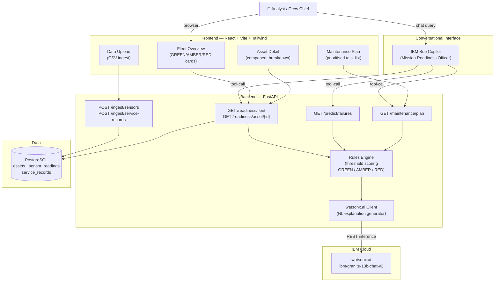

# Architecture

## System Architecture

The Mission Readiness Officer is a three-tier web application augmented by an IBM Bob conversational copilot. The React frontend provides a visual fleet dashboard; the FastAPI backend hosts the rules engine and all data APIs; PostgreSQL persists sensor readings, service records, and computed readiness scores; IBM Bob acts as the primary conversational interface using tool-calling to the same FastAPI endpoints the dashboard uses; and watsonx.ai generates natural-language explanations for every AMBER/RED readiness issue.

## Components

| Component | Technology | Responsibility |
|---|---|---|
| Frontend | React 18 + Vite + Tailwind CSS | Fleet dashboard UI, CSV upload, maintenance plan view |
| Backend API | FastAPI + Uvicorn | Request routing, data ingestion, orchestration |
| Rules Engine | Python (`rules_engine.py`) | Per-component threshold scoring, time-to-failure estimation |
| Database ORM | SQLAlchemy | Asset, sensor reading, and service record persistence |
| Database | PostgreSQL 15 | Persistent storage for all sensor and readiness data |
| AI / Explanation | watsonx.ai (`ibm/granite-13b-chat-v2`) | Natural-language explanations for AMBER/RED components |
| Copilot | IBM Bob | Conversational interface; tool-calling to FastAPI endpoints |
| Container | Docker Compose | One-command local deployment for all services |

## Data Flow

1. A technician uploads a HUMS sensor CSV and service records CSV through the React **Data Upload** page
2. The FastAPI `/ingest/*` endpoints parse both files and write rows to `sensor_readings` and `service_records` tables in PostgreSQL
3. On every `/readiness/*` or `/predict/*` request, the **Rules Engine** reads the latest sensor values per asset/component from PostgreSQL and evaluates each against its threshold band, producing a GREEN/AMBER/RED status and a numeric risk score (0–100)
4. For any AMBER or RED component, the rules engine calls the **watsonx.ai client**, which posts a structured prompt to the watsonx.ai inference endpoint and receives a plain-English explanation
5. Bob receives a user query, selects the appropriate tool from `.bob/tools.yaml`, calls the FastAPI endpoint, and composes the JSON response into a natural-language briefing
6. The React dashboard polls the `/readiness/fleet` endpoint to refresh asset cards; analysts can drill into `/readiness/asset/{id}` for per-component detail

## Security Considerations

- All secrets (API keys, DB credentials) are stored in `.env` and never committed — `.gitignore` excludes `.env`
- `.env.example` documents required variables with placeholder values only
- CORS is restricted to `localhost:3000` in development; the allowed origins list should be tightened for any production deployment
- The watsonx.ai API key is stored server-side only — the React frontend never has access to it

## Scalability Notes

The FastAPI backend is stateless (no in-process session state) and could be horizontally scaled behind a load balancer once the PostgreSQL connection pool is externalised (e.g., via PgBouncer). The rules engine evaluation is CPU-bound and synchronous in the prototype; at fleet scale it should be moved to a background task queue (e.g., Celery + Redis) triggered on ingest rather than computed on every API request. The watsonx.ai calls are the primary latency bottleneck and would benefit from response caching keyed on (asset_id, component, reading_hash).
